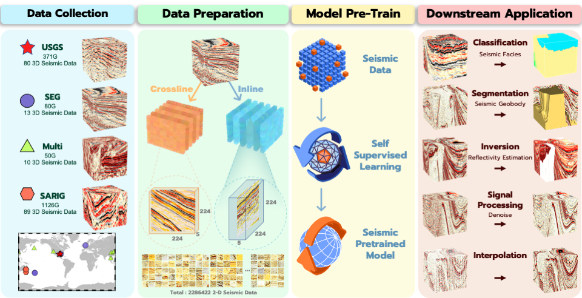

<p align="center" width="100%">

</p>


<div>
<div align="center">
    <a href='https://github.com/shenghanlin/' target='_blank'>Hanlin Sheng
    <sup>1</sup></a>&emsp;
    <a href='http://cig.ustc.edu.cn/people/list.htm' target='_blank'>Xinming  Wu<sup>1,†,‡</sup></a>&emsp;
    <a href='http://cig.ustc.edu.cn/people/list.htm' target='_blank'>Xu Si<sup>1</sup></a>&emsp;
    <a href='http://cig.ustc.edu.cn/people/list.htm' target='_blank'>Jintao Li<sup>1</sup></a>&emsp;
    </br>
    <a href='https://www.huawei.com/cn/' 
    target='_blank'>Sibo Zhang <sup>2</sup></a>&emsp;
    <a href='https://www.huawei.com/cn/' 
    target='_blank'>Xudong Duan <sup>2</sup></a>&emsp;
</div>
<div>

<div align="center">
    <sup>1</sup>
    University of Science and Technology of China&emsp;
    <sup>2</sup>
    Huawei&emsp;
    </br>
    <!-- <sup>*</sup> Equal Contribution&emsp; -->
    <sup>†</sup> Corresponding Author&emsp;
    <sup>‡</sup> Project Lead&emsp;
</div>

-----------------

# 🌟 Seismic Foundation Model (SFM)

 As shown in this workflow figure, we test the Seismic Foundation Model's performance in segmentation tasks and regression tasks, specifically in classification (i.e. seismic facies), segmentaion (i.e. seismic geobody), signal processing (i.e. denoising), inversion (i.e. reflectivity estimation), and interpolation.

This is a PyTorch/GPU implementation of the paper [Seismic Foundation Model](https://arxiv.org/abs/2309.02791):
```
@article{sheng2023seismic,
  title={Seismic Foundation Model (SFM): a new generation deep learning model in geophysics},
  author={Sheng, Hanlin and Wu, Xinming and Si, Xu and Li, Jintao and Zhang, Sibio and Duan, Xudong},
  journal={arXiv preprint arXiv:2309.02791},
  year={2023}
}
```

## 🌟 News
* **2023.9.7:** Paper is released at arxiv, and code will be gradually released.  ⌛⌛⌛
* **2023.8.7:** Github Repository Initialization (copy from Meta-Transformer). 

## &#x1F449; Pre-train & Fine-tune Code

* The pre-training instruction is in [PRETRAIN.md](SFM-Pretrain/README.md).

* The Fine-tuning instruction is in [FINETUNE.md](SFM-Finetune/README.md).


## :rocket: Model Zoo & Data Release

<!-- <details> -->
<summary> Open-source Pretrained Models </summary>
<br>
<div>

|    Model   |      Pretraining Size      |  Download |
|------------|:--------------------------:|:----------:|
| SFM-Base   |         224 × 224          | [<a href='https://rec.ustc.edu.cn/share/5264ec70-e839-11ee-bbda-13c1c8639a68' target='_blank'>ckpt]    |  
| SFM-Base-512   |         512 × 512          | [<a href='https://rec.ustc.edu.cn/share/822fce90-e839-11ee-af60-2fdbc15c6897' target='_blank'>ckpt]    |  
| SFM-Large  |         224 × 224          | [<a href='https://rec.ustc.edu.cn/share/98681bf0-e839-11ee-9b6e-6f4613c99ceb' target='_blank'>ckpt]    |
| SFM-Large-512  |         512 × 512          | [<a href='https://rec.ustc.edu.cn/share/a8abda40-e839-11ee-92af-afdff0d8db7d' target='_blank'>ckpt]    |    

<summary> Open-source Training & DownStream Fine-tune Task Data</summary>
<br>
<div>

|    Task   |      Size      |  Download |
|:------------------:|:--------------------------:|:----------:|
| PreTrain   |         224 × 224          | [<a href='https://rec.ustc.edu.cn/share/07e7c9a0-e83a-11ee-9663-ada87855acba' target='_blank'>DatFile]    |  
| Seismic Facies Classification   |         768 × 768          | [<a href='https://rec.ustc.edu.cn/share/d6cd54a0-e839-11ee-982a-9748e54ad7a4' target='_blank'>DatFile]    |  
| Seismic GeoBody Identification  |         224 × 224          | [<a href='https://rec.ustc.edu.cn/share/c8e35880-e839-11ee-8461-f3bb734ae389' target='_blank'>DatFile]    |  
| Inversion (Reflectivity Estimation)  |         224 × 224          | [<a href='https://rec.ustc.edu.cn/share/ea08a900-e839-11ee-95d8-658d8d5cc990' target='_blank'>DatFile]    |  
| Signal Processing (Denoise)   |         224 × 224          | [<a href='https://rec.ustc.edu.cn/share/ba8616a0-e839-11ee-b98c-bd79efca2f3b' target='_blank'>DatFile]    |  
| Interpolation                 |         224 × 224          | [<a href='https://rec.ustc.edu.cn/share/fe455d00-e839-11ee-8cc5-71e53e31c64f' target='_blank'>DatFile]    |

# :neckbeard: Quick Guide

## Installation

To prepare the environment, please follow the following instructions.
```shell
# create virtual environment
conda create -n SFM python=3.9.12
conda activate SFM

# install pytorch
pip3 install torch==1.8.1+cu111 torchvision==0.9.1+cu111 torchaudio==0.8.1 -f https://download.pytorch.org/whl/lts/1.8/torch_lts.html

# install other requirements
pip install -r requirements.txt

# if you want to visualize the results as shown in SFM-Finetune/Application/visualization.ipynb
pip install jupyter notebook
python -m ipykernel install --user --name=SFM --display-name="Python (SFM)"
```
## Download Dataset & Model

Place the downloaded dataset and model in the corresponding folder.


- If you want to obtain a foundation model pre-trained from scratch, Download the ```Pretrain data``` zip file in ```Data``` folder.
```shell
# First execute merge
zip -s 0 mae_data_more.zip --out pretrain.zip
# Unzip the merged compressed file
unzip pretrain.zip
```

- If you want to use our pre-trained model directly, Download ```Pre-trained model``` and place it in folder ```SFM-Pretrain/output_dir```
```shell
cd SFM-Pretrain
mkdir output_dir
cd output_dir 
```

-  If you want to apply the model to downstream tasks, Download the DownStream Task data zip file in ```Data``` folder.
```shell
cd Data
unzip *.zip
```
## Facies Example

1. Download the DownStream Facies Task model [facies.pth](https://mailustceducn-my.sharepoint.com/:u:/g/personal/hanlins_mail_ustc_edu_cn/EcK3TARvKDdCmvIT1lztxtEBSJqhMZmYuT7XWIG1nnT9jg?e=ly9rJh) and place it in folder ```SFM-Finetune/Application/Facies/SFM-Finetune/```
 
2. Download the DownStream [Facies Data](https://mailustceducn-my.sharepoint.com/:f:/g/personal/hanlins_mail_ustc_edu_cn/ElUKdIW6VhZOrekvngY7TqgBKYqgVfgC6fOg_vPdK8VYDA?e=xYrA0e) and place it in folder Data/ then ```unzip *.zip```

3. run the following code:

```shell
cd SFM-Finetune/Application
#Use jupyter notebbok to open visualization.ipynb
jupyter notebook
```

<br>
<div>
# License
This project is released under the [MIT license](LICENSE).

