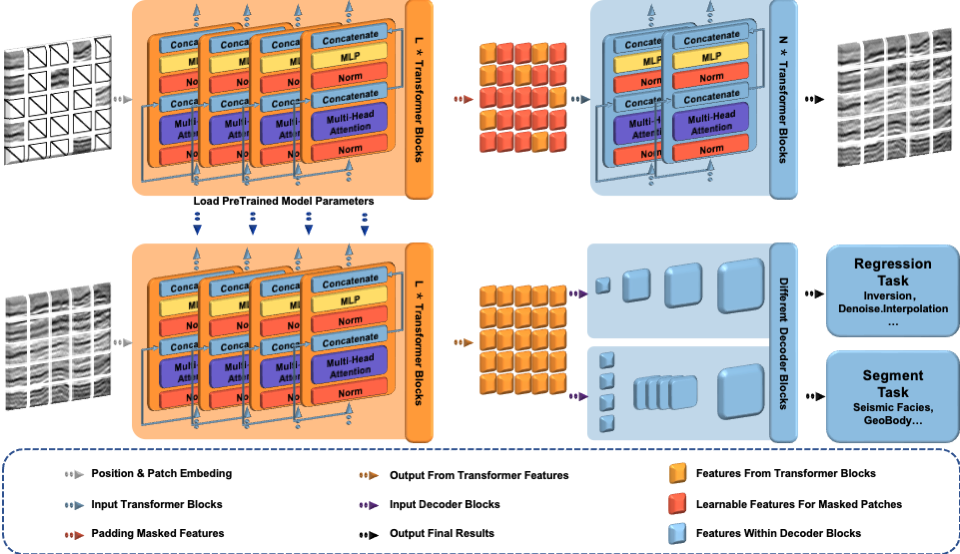

## Seismic Foundation Model - Fine-tune

<p align="center">
  
</p>

This is a PyTorch/GPU implementation of the paper [Seismic Foundation Model](https://arxiv.org/abs/2309.02791):
```
@article{sheng2023seismic,
  title={Seismic Foundation Model (SFM): a new generation deep learning model in geophysics},
  author={Sheng, Hanlin and Wu, Xinming and Si, Xu and Li, Jintao and Zhang, Sibio and Duan, Xudong},
  journal={arXiv preprint arXiv:2309.02791},
  year={2023}
}
```
* This repo is a modification on the [MAE](https://github.com/facebookresearch/mae). Installation and preparation follow that repo.

* This repo is based on [`timm==0.3.2`](https://github.com/rwightman/pytorch-image-models), for which a [fix](https://github.com/rwightman/pytorch-image-models/issues/420#issuecomment-776459842) is needed to work with PyTorch 1.8.1+.


## Fine-tune

To fine-tune the Downsteam Task**, run the ```./finetune-SEAM.sh``` :
```
CUDA_VISIBLE_DEVICES='5' OMP_NUM_THREADS=1 python -m torch.distributed.launch --nproc_per_node=1 main_finetune.py \
    --data_path ${DATA_DIR} \
    --accum_iter 2 \
    --batch_size 1 \
    --model vit_base_patch16 \
    --finetune './output_dir_more/Base-512.pth'\
    --output_dir './finetune_result/SEAM/modelbase_512/' \
    --log_dir './finetune_result/SEAM/modelbase_512/' \
    --epochs 100 \
    --warmup_epochs 10 \
    --blr 1.5e-3 --weight_decay 0.05 \
    --layer_decay 0.05 --drop_path 0.1 --reprob 0.25 \
    --dist_eval
```
- Here the effective batch size is 64 (`batch_size` per gpu) * 8 (`nodes`) * 8 (gpus per node) = 4096. If memory or # gpus is limited, use `--accum_iter` to maintain the effective batch size, which is `batch_size` (per gpu) * `nodes` * 8 (gpus per node) * `accum_iter`.
- `blr` is the base learning rate. The actual `lr` is computed by the [linear scaling rule](https://arxiv.org/abs/1706.02677): `lr` = `blr` * effective batch size / 256.
-`finetune` can be used to loaded pre-trained model.
- `modelComparsion` can be placed in a bash file to train ['Unet'](https://github.com/bigmb/Unet-Segmentation-Pytorch-Nest-of-Unets)/['Deeplab'](https://github.com/jfzhang95/pytorch-deeplab-xception) models with the same parameters. 
- `forzen` can be used to freeze the loaded pre-trained model parameters.

## Visualization
You can use `Application\finetune_results_visualization.ipynb` to show the results

## Fine-tune On your own task

1. You can mimic the file `util/datasets.py` by first writing a Dataloader
2. Add your Dataloader and corresponding Task to the file `main_finetune.py`.
3. Add your task to the discriminant statement of the specified model.
4. You can mimic the file `Application/*.sh` to set hyperparameters for experimentation.
5. Start Training！


### License

This project is under the CC-BY-NC 4.0 license. See [LICENSE](LICENSE) for details.
